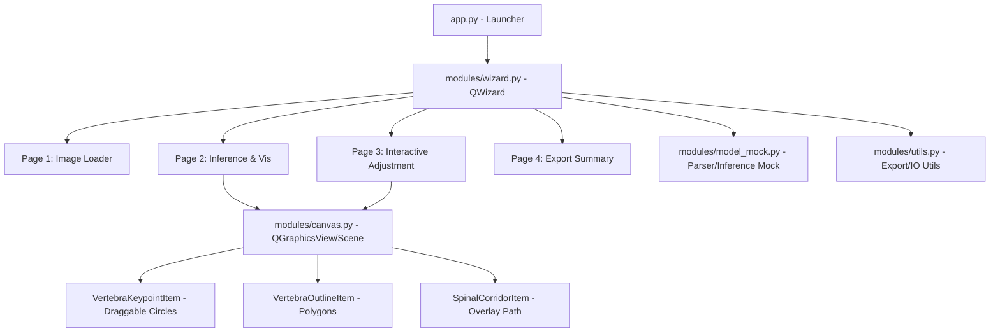

# Scoliosis Detection & Measurement UI

An advanced, interactive medical-tech desktop application built in Python using PySide6 (Qt for Python). This application guides clinicians through a 4-step wizard to load an X-ray image of a spine, run a mock deep learning model to detect 23 vertebrae keypoints, visualize and dynamically adjust keypoints, and export finalized clinical data (including calculated Cobb angles) to a structured JSON file.

---

## 📐 Design Architecture

The application is built on a clean, decoupled **Model-View-Presenter (or Model-View-Controller)** and **Qt Graphics View Framework** architecture. It implements the Single Responsibility Principle (SRP) to keep the components highly modular, testable, and maintainable.

### High-Level Components



1. **Application Launcher (`app.py`)**:
   - The main entry point. Sets up the `QApplication` loop, registers system paths, and executes the wizard.
2. **Global Configuration (`config.py`)**:
   - Houses global constants, color settings, anatomical labels, and default parameters.
3. **Wizard Coordinator (`modules/wizard.py`)**:
   - Subclasses `QWizard`. Acts as the central state-holder, managing shared variables (e.g., loaded image path, model results, updated coordinates) and transitions between wizard pages.
4. **Wizard Pages (`modules/pages.py`)**:
   - Subclasses `QWizardPage`.
   - **Page 1 (Image Loader)**: Features a native drag-and-drop target and a browse button. Enables the "Next" button only when a valid image is loaded.
   - **Page 2 (Model Inference & Visualization)**: Triggers the mock model inference upon entry, initializing the Interactive Canvas with the original image, a semi-transparent spinal corridor polygon, vertebra outlines, and initial Cobb angle annotations.
   - **Page 3 (Interactive Adjustment)**: Displays the same interactive canvas but enables dragging on the vertebra keypoints. As any point is dragged, the canvas emits signals to update the vertebra shape, the spinal corridor boundary, and recalculate Cobb angles in real-time.
   - **Page 4 (Export Data)**: Lists a summary of final control points and Cobb angles, and saves the final data to a structured JSON file upon clicking "Export".
5. **Interactive Canvas (`modules/canvas.py`)**:
   - Extends `QGraphicsView` and `QGraphicsScene` to manage high-performance graphics.
   - **`VertebraOutlineItem`**: Draws a polygon connecting the 4 corners of a vertebra.
   - **`SpinalCorridorItem`**: Draws a smooth, semi-transparent overlay corridor connecting the left and right boundaries of all 23 vertebrae.
   - **`VertebraKeypointItem`**: Custom draggable `QGraphicsEllipseItem` with `ItemIsMovable` flag. Communicates movement to coordinate and trigger recalculation.
6. **Model Mock (`modules/model_mock.py`)**:
   - Simulates AI inference by reading the provided JSON file (`test_json/test_output.json`) and instantiating structured python model objects.
7. **Utilities (`modules/utils.py`)**:
   - Manages mathematical formulas (oblique angles and Cobb angle calculations) and handles JSON file export.

---

## 🛠 Tech Stack & Dependencies

The application uses modern Python desktop development libraries:
- **Language**: Python 3.10+
- **GUI Framework**: [PySide6 (Qt for Python) v6.5+](https://doc.qt.io/qtforpython-6/)
- **Image Processing**: [Pillow (PIL) v10.0+](https://pillow.readthedocs.io/)
- **Standard Libraries**: `json`, `math`, `os`, `sys`

---

## ⚙️ Environment Setup

Follow these steps to set up your local development environment on Windows:

1. **Clone or Open the Project**:
   Open a PowerShell or CMD terminal in the project directory:
   ```powershell
   cd d:\repositories\scoliosis_detection_ui
   ```

2. **Create a Virtual Environment**:
   Create a dedicated local virtual environment:
   ```powershell
   python -m venv .venv
   ```

3. **Activate the Virtual Environment**:
   - In **PowerShell**:
     ```powershell
     .venv\Scripts\Activate.ps1
     ```
   - In **CMD**:
     ```cmd
     .venv\Scripts\activate.bat
     ```

4. **Install Dependencies**:
   Upgrade `pip` and install the required dependencies:
   ```powershell
   python -m pip install --upgrade pip
   pip install PySide6 pillow
   ```

---

## ⚙️ How to Run the Application

Once your virtual environment is active and dependencies are installed, run the application from the root directory:

```powershell
python app.py
```

### Packaging / Deploying (Optional)

To bundle the application into a standalone Windows executable (`.exe`), you can use `PyInstaller`:

1. Install PyInstaller inside your virtual environment:
   ```powershell
   pip install pyinstaller
   ```

2. Package the app:
   ```powershell
   pyinstaller --noconsole --onefile --add-data "test_json;test_json" app.py
   ```

3. The compiled executable will be located in the `dist/` directory:
   ```powershell
   .\dist\app.exe
   ```

---

## 📐 Clinical Math Specifications

### 1. Oblique Angle Calculation
For each vertebra $i$, there are 5 keypoints:
- **Keypoint 0**: Center point of the vertebra.
- **Keypoint 1 & 2**: Left-Top and Right-Top corners of the vertebra body.
- **Keypoint 3 & 4**: Left-Bottom and Right-Bottom corners of the vertebra body.

The tilt/oblique angles of the vertebra are defined as:
- **Upper Oblique Angle**:
  $$\theta_{\text{upper}} = \text{atan2}(y_{\text{Keypoint 2}} - y_{\text{Keypoint 1}}, x_{\text{Keypoint 2}} - x_{\text{Keypoint 1}}) \times \frac{180}{\pi}$$
- **Lower Oblique Angle**:
  $$\theta_{\text{lower}} = \text{atan2}(y_{\text{Keypoint 4}} - y_{\text{Keypoint 3}}, x_{\text{Keypoint 4}} - x_{\text{Keypoint 3}}) \times \frac{180}{\pi}$$

### 2. Cobb Angle Calculation
The Cobb angle measures the curve of the scoliosis between two selected tilted vertebrae (an upper end vertebra and a lower end vertebra). It is calculated as:
$$\text{Cobb Angle} = |\theta_{\text{upper, upper\_vertebra}} - \theta_{\text{lower, lower\_vertebra}}|$$

The system calculates Cobb angles for pre-defined clinical interest pairs (e.g., pairs $(5, 11)$ and $(11, 18)$ as defined in your model outputs) and highlights the maximum/selected Cobb angle in real-time.
