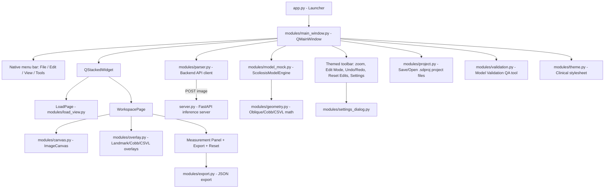

# Scoliosis Detection & Measurement UI

An interactive medical-tech desktop application built in Python using PySide6 (Qt for Python). It gives clinicians a single-page clinical workspace: load a spine X-ray, send it to a real AI inference backend, view the predicted vertebra landmarks and Cobb angle measurements overlaid on the image, manually refine landmarks in Edit mode (with undo/redo), and export the finalized clinical data.

## Design Architecture

The application is a **single-page clinical workspace**. Clinicians use this tool repeatedly throughout the day, so the UI favors a persistent toolbar and a workspace they can jump around in freely (view ↔ edit, undo/redo, re-export, reset) rather than a linear multi-page flow.

The menu bar (File / Edit / View / Tools) and every dialog (Settings, Export, Model Validation, file/color pickers, message boxes) intentionally use **native OS chrome**, only the toolbar and the workspace content (canvas + measurement panel) carry the custom clinical dark theme.

### High-Level Components



1. **Application Launcher (`app.py`)**: entry point. Constructs and shows `MainWindow`; no theming happens at the `QApplication` level (see the native-chrome note above).
2. **Global Configuration (`config.py`)**: window sizing, supported image extensions, backend API URL/timeout, keypoint index map, overlay colors, drag-handle sizing.
3. **Clinical Theme (`modules/theme.py`)**: a single dark, muted, low-glare stylesheet, applied *only* to the toolbar, the stacked workspace, and the status bar, never to the menu bar, the `QMainWindow` itself, or any dialog.
4. **Main Window (`modules/main_window.py`)**: owns the native menu bar and the themed toolbar, wires the backend inference call, and swaps between the Load page and the Workspace page.
5. **Load Page (`modules/load_view.py`)**: drag-and-drop or File→Open image import, JPG/JPEG/PNG validation, thumbnail preview, and the Submit action that kicks off inference.
6. **Image Canvas (`modules/canvas.py`)**: a `QGraphicsView`/`QGraphicsScene` viewer for the base X-ray layer only, pan, zoom, fit-to-view, resize-safe. It never modifies the source pixmap; all overlays render as separate scene items on top of it.
7. **Overlay Layer (`modules/overlay.py`)**: vertebra outlines, the spinal corridor fill, draggable landmark handles, Cobb measurement lines/labels, and the CSVL reference line, all owned by `OverlayLayer`, driven by `ScoliosisModelEngine`'s current data. Landmark handles keep a constant on-screen size regardless of zoom (`ItemIgnoresTransformations`) and are drawn slightly translucent.
8. **Backend Client (`modules/parser.py`)**: posts the loaded image to the inference API on a background `QThread` (`InferenceWorker`) so the UI never blocks; raises a clear error if the backend is unreachable, times out, or returns something unparseable.
9. **Model Engine (`modules/model_mock.py`)**: `ScoliosisModelEngine` holds the current detections/keypoints/angles, recalculates oblique and Cobb angles after any edit, and manages the undo/redo history and the "reset to AI original" baseline snapshot.
10. **Geometry (`modules/geometry.py`)**: pure, unit-testable math, the oblique-angle formula (matched exactly to the backend's convention, see below), CSVL/apex-vertebra calculation, and the comparison functions used by the Model Validation tool.
11. **Settings Dialog (`modules/settings_dialog.py`)**: inference API URL, default overlay line color, and default export folder, all persisted with `QSettings`.
12. **Export (`modules/export.py`)**: Export modal, Raw JSON is fully wired up (timestamped filename, folder picker); Annotated Image, PDF Report, and CSV are shown as "coming soon" so the intended end-state UX is visible now.
13. **Project Save/Open (`modules/project.py`)**: a `.sdproj` file (a zip bundle: metadata, an embedded copy of the source image, current detections, and the AI's original baseline) that lets a clinician save progress on an in-progress assessment and resume it later, including manual edits, without re-running AI inference. Distinct from Export: Export produces a one-way clinical deliverable, a project is meant to be reopened and kept editing.
14. **Model Validation (`modules/validation.py`)**: a separate ML-team QA workflow, loads a prediction JSON and a ground-truth label JSON, and reports vertebra-count accuracy, per-vertebra oblique-angle error, Cobb curve count/accuracy, and a processing-time note.
15. **Utilities (`modules/utils.py`)**: JSON export I/O and clinical summary text generation.

### The AI backend (`server.py`)

`server.py` is a FastAPI service (`POST /predict`, `GET /health`) that runs the real detectron2 + EfficientNet-B5 keypoint/mask model and returns detections, keypoints, oblique angles, Cobb angle pairs, and image dimensions as JSON. The desktop client and the server are meant to run as two separate processes (and can be on two separate machines, the client only needs the server's URL, configurable in Settings).

**Model weights are not included in this repository** (see the Confidential Data note below). To run the server yourself, place the trained checkpoint at:

```
model/model_t001_6_effb5_mask_kp_2cls/model_final_run.pth
```

The server loads this file *before* it opens its port, if it's missing, `python server.py` fails fast rather than starting up broken.

### Current Implementation Status

**Built:**
- Toolbar/menu chrome, native menu bar (File / Edit / View / Tools) plus a themed toolbar (zoom, Edit Mode, Undo/Redo, Reset Edits, Settings) collected on the far right, with keyboard shortcuts throughout (see below)
- Open Image, drag-and-drop + File→Open, JPG/JPEG/PNG validation, invalid files rejected
- Display Image, `QGraphicsView` viewer, aspect ratio preserved, fit/centered, resize-safe (zoom persists across window resizes once you've manually zoomed), original image untouched
- Live backend inference, submitting an image posts to the FastAPI server on a background thread; a clear, non-blocking error state (with Retry) if the backend is unreachable
- Landmark/Cobb/CSVL overlays, all rendered on top of the untouched base image
- Edit Mode, drag any landmark to correct it, with live-updating Cobb angle/CSVL/measurement-panel feedback
- Undo/Redo for landmark edits (one entry per completed drag, not per mouse-move tick)
- Reset Edits, discards manual adjustments and restores the AI's original result, independent of the full workflow Reset (which clears the loaded image entirely and returns to the Load page)
- Measurement panel: Primary Cobb Angle, Curve 1, Curve 2, Apex, CSVL Deviation, Vertebrae, Processing Time
- Settings modal, inference API URL, default line color, default export folder (all persisted)
- Export modal, Raw JSON export with a timestamped filename; Annotated Image / PDF Report / CSV are present as "coming soon"
- Save Project / Open Project (File menu), saves the source image, current (possibly edited) detections, and the AI's original baseline to a `.sdproj` file so an in-progress assessment can be resumed later without re-running AI inference
- Model Validation tool (Tools menu), prediction-vs-label QA comparison for the ML team

**Not yet built:**
- Annotated Image, PDF Report, and CSV export formats (currently disabled placeholders in the Export modal)

The previous 4-step wizard implementation (`modules/wizard.py`, `modules/pages.py`) is retained in the repo for reference but is no longer used by `app.py`.

## Keyboard Shortcuts

| Action | Shortcut |
|--|--|
| Open Image | `Ctrl+O` |
| Open Project | `Ctrl+Shift+O` |
| Save Project | `Ctrl+Shift+S` |
| Export Results | `Ctrl+S` |
| Settings | `Ctrl+,` |
| Exit | `Ctrl+Q` |
| Undo | `Ctrl+Z` |
| Redo | `Ctrl+Shift+Z` |
| Reset Edits (discard manual adjustments) | `Ctrl+Shift+R` |
| Full Reset (clear image, return to start) | `Ctrl+R` |
| Zoom In | `Ctrl++` |
| Zoom Out | `Ctrl+-` |
| Fit to View | `Ctrl+0` |
| Toggle Edit Mode | `Ctrl+E` |
| Retry AI Analysis | `F5` |

## Tech Stack & Dependencies

**Desktop client** (`requirements.txt`):
- **Language**: Python 3.10+
- **GUI Framework**: [PySide6 (Qt for Python) v6.5+](https://doc.qt.io/qtforpython-6/)
- **Image Processing**: [Pillow (PIL) v10.0+](https://pillow.readthedocs.io/)
- **HTTP client**: `requests` (talks to the inference server)

**Inference backend** (`requirements-server.txt`), see that file for full notes:
- **API**: FastAPI + uvicorn
- **Model**: PyTorch + detectron2 (Mask/Keypoint R-CNN with an EfficientNet-B5 FPN backbone via `timm`) + OpenCV
- `torch` and `detectron2` aren't plain pinned PyPI installs, they need to match your exact CUDA/OS combination; see the comments in `requirements-server.txt`.

## Environment Setup

### Desktop client

```powershell
cd d:\repositories\scoliosis_detection_ui
python -m venv .venv
.venv\Scripts\Activate.ps1        # PowerShell
# or: .venv\Scripts\activate.bat  # CMD

python -m pip install -upgrade pip
pip install -r requirements.txt
```

### Inference backend

Typically a separate environment (ideally a GPU-equipped machine):

```powershell
pip install -r requirements-server.txt
pip install torch -index-url https://download.pytorch.org/whl/<your-cuda-tag>
pip install "git+https://github.com/facebookresearch/detectron2.git"
```

Then place the trained weights at `model/model_t001_6_effb5_mask_kp_2cls/model_final_run.pth` (see the Confidential Data note below, this file is never committed to the repo).

## How to Run

**1. Start the backend first**, and confirm it's actually up before touching the app:

```powershell
python server.py
```

```powershell
curl http://127.0.0.1:4000/health
# expect: {"status":"ok"}
```

First load can be slow (building the model, moving it to the GPU).

**2. Then start the desktop client** (a separate terminal, or a separate machine, `config.py` defaults `INFERENCE_API_URL` to `http://127.0.0.1:4000/predict`; change it in-app via Settings if the server lives elsewhere):

```powershell
python app.py
```

Drag an X-ray onto the Load page (or File → Open Image), then Submit. If the backend is unreachable, the image still displays and you can retry once it's back (`F5` / View → Retry AI Analysis).

### Packaging / Deploying the client (Optional)

```powershell
pip install pyinstaller
pyinstaller -noconsole -onefile -add-data "test_json;test_json" app.py
```

The compiled executable will be in `.\dist\app.exe`.

## Confidential Data

The following are intentionally **excluded from version control** (see `.gitignore`) and must be provided locally:

- `model/`, trained model weight checkpoints (proprietary)
- `test_api_visualization.ipynb`, internal reference notebook showing how the model's API was originally exercised
- `blueprint.md`, the original internal build spec used to bootstrap this app

None of these are required to read or modify the application code itself; they're only needed to run the real inference backend or to consult internal background material.

## Clinical Math Specifications

### 1. Oblique Angle Calculation

For each vertebra $i$, there are 5 keypoints:
- **Keypoint 0**: Center point of the vertebra (recalculated as the average of keypoints 1-4 after any edit).
- **Keypoint 1 & 2**: Left-Top and Right-Top corners of the vertebra body.
- **Keypoint 3 & 4**: Left-Bottom and Right-Bottom corners of the vertebra body.

The oblique angle between two corner points is **not** a plain `atan2(dy, dx)`. It matches `server.py`'s `cal_oblique01` convention exactly (ported into `modules/geometry.py::oblique_angle`, and used by `modules/model_mock.py` for all recalculation, including live edits):

```
dx = x1 - x2, dy = y1 - y2
 dx == 0, dy == 0  -> 0 degrees
 dx == 0, dy >  0  -> -90 degrees
 dx == 0, dy <  0  -> +90 degrees
 dx <  0, dy == 0  -> 0 degrees
 dx >  0, dy == 0  -> 0 degrees
 dx <  0            -> atan(dy / dx)
 dx >  0, dy >  0  -> -90 degrees - atan(dy / dx)
 dx >  0, dy <  0  -> +90 degrees + atan(dy / dx)
```

A plain `atan2(dy, dx)` only agrees with this formula when the "left" keypoint's x-coordinate is less than the "right" keypoint's. Whenever a vertebra is rotated enough that this ordering flips - plausible right at a curve's apex, exactly where accuracy matters most - a plain `atan2` would disagree with the model's own convention by up to 180 degrees.

- **Upper Oblique Angle**: computed from Keypoint 1 (top-left) and Keypoint 2 (top-right).
- **Lower Oblique Angle**: computed from Keypoint 3 (bottom-left) and Keypoint 4 (bottom-right).

### 2. Cobb Angle Calculation

The Cobb angle measures the curve of the scoliosis between two selected tilted vertebrae (an upper end vertebra and a lower end vertebra):

Cobb Angle = | oblique(upper, upper_vertebra) - oblique(lower, lower_vertebra) |

The backend determines which vertebra pairs are clinically relevant (its `angle_pairs` output, e.g. pairs (5, 11) and (11, 18)); the client recalculates each pair's angle live as landmarks are edited, and reports the maximum as the Primary Cobb Angle.

### 3. CSVL and Apex Vertebra

The backend JSON doesn't label a sacrum landmark, so the **Central Sacral Vertical Line (CSVL)** is approximated as the x-coordinate of the bottommost detected vertebra - the closest available anatomical proxy. The **apex vertebra** is the one whose center deviates furthest horizontally from the CSVL; its deviation is reported in pixels (the JSON carries no pixel-spacing/calibration field, so there's no way to convert to mm).
