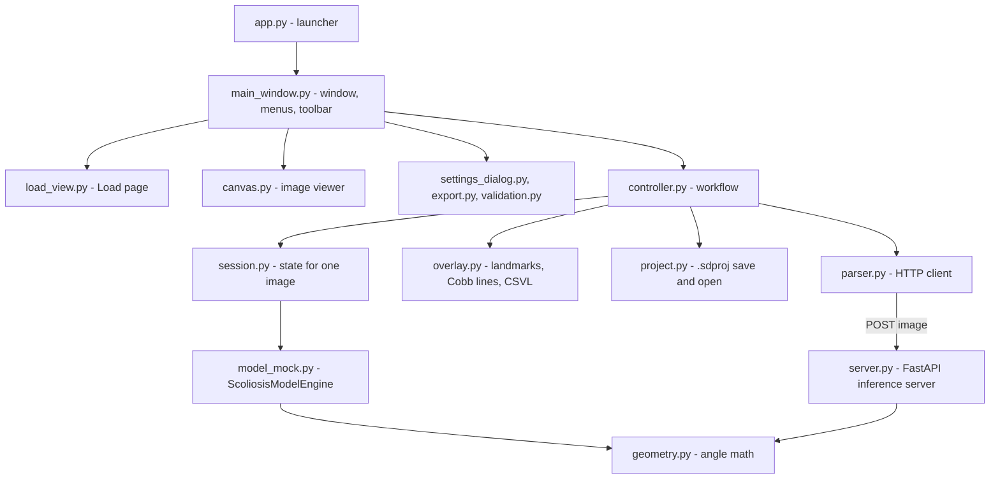

# Scoliosis Detection & Measurement UI

Desktop app for measuring scoliosis on a spine X-ray. Load an image, the AI server finds the vertebrae and the Cobb angles, you check and adjust the landmarks, then export the result.

There are two programs:

| Program | File | What it does |
|--|--|--|
| Server | `server.py` | Runs the AI model. Needs the model weights file. A GPU is recommended. |
| App | `app.py` | The desktop program. Sends the image to the server and shows the result. |

They can run on the same computer or on two different ones.

## Install

You need **Python 3.10 or newer** and **Git**.

### Step 1. Get the code

```
git clone https://github.com/reerooryu/scoliosis_detection_ui.git
cd scoliosis_detection_ui
```

### Step 2. Create and activate a virtual environment

macOS / Linux:

```
python3 -m venv .venv
source .venv/bin/activate
```

Windows (PowerShell):

```
python -m venv .venv
.venv\Scripts\Activate.ps1
```

### Step 3. Install the app

```
python -m pip install --upgrade pip
pip install -r requirements.txt
```

If the server runs on another computer, stop here and go to [Run](#run), Step 2.

### Step 4. Install the server

```
pip install -r requirements-server.txt
pip install torch torchvision
pip install --no-build-isolation "git+https://github.com/facebookresearch/detectron2.git"
```

- Run the three commands in this order. Detectron2's installer needs the `torch` you just installed, which is why `--no-build-isolation` is required. Without it the install fails with `No module named 'torch'`.
- For an NVIDIA GPU, replace the `torch` line with the command for your CUDA version from https://pytorch.org/get-started/locally/.
- Detectron2 is built from source, so a C++ compiler must be installed (Xcode Command Line Tools on macOS, Visual Studio Build Tools on Windows).
- On an Apple Silicon Mac, if the build stops with an architecture error, put `ARCHFLAGS="-arch arm64"` in front of the Detectron2 command.

### Step 5. Add the model weights

The weights are not in this repository. Get the file `model_final_run.pth` from the project team and copy it into this folder (create the folder if it does not exist):

`model/model_t001_6_effb5_mask_kp_2cls/`

This is a location, not a command. To check the file is in place, run:

```
ls model/model_t001_6_effb5_mask_kp_2cls
```

It should list `model_final_run.pth`.

## Run

### Step 1. Start the server

```
python server.py
```

Wait until it prints `Uvicorn running on http://0.0.0.0:4000`. The first start is slow because the model has to load. If the weights file is missing, the server stops with an error.

To check it is up, open http://127.0.0.1:4000/health in a browser. You should see `{"status":"ok"}`.

### Step 2. Start the app

In a second terminal, with the virtual environment activated:

```
python app.py
```

### Step 3. Set the server address (only if the server is on another computer)

Open Settings (`Ctrl+,`) and set **Inference API URL** to `http://<server-address>:4000/predict`. The default is `http://127.0.0.1:4000/predict`.

### Step 4. Analyse an X-ray

1. Drag a JPG or PNG onto the Load page, or use File → Open Image.
2. Click **Submit**. The landmarks, Cobb lines and measurements appear when the server answers.
3. To correct a landmark, turn on Edit Mode (`Ctrl+E`) and drag it. The angles update as you drag.
4. Export the result (`Ctrl+S`), or save a project (`Ctrl+Shift+S`) to continue later.

If the server cannot be reached, the image still opens. Start the server, then press `F5` to retry.

## Keyboard shortcuts

On macOS, use `Cmd` instead of `Ctrl`.

| Action | Shortcut |
|--|--|
| Open Image | `Ctrl+O` |
| Open Project | `Ctrl+Shift+O` |
| Save Project | `Ctrl+Shift+S` |
| Export Results | `Ctrl+S` |
| Settings | `Ctrl+,` |
| Exit | `Ctrl+Q` |
| Undo | `Ctrl+Z` |
| Redo | `Ctrl+Shift+Z` |
| Reset Edits (back to the AI result) | `Ctrl+Shift+R` |
| Full Reset (clear the image, return to start) | `Ctrl+R` |
| Zoom In | `Ctrl++` |
| Zoom Out | `Ctrl+-` |
| Fit to View | `Ctrl+0` |
| Toggle Edit Mode | `Ctrl+E` |
| Retry AI Analysis | `F5` |

## What it does

- **Load**: drag-and-drop or File → Open Image. JPG, JPEG and PNG.
- **Analyse**: the image is sent to the server in the background, so the window stays responsive.
- **Overlay**: vertebra outlines, Cobb lines and labels, and the CSVL are drawn on top of the image. The image itself is never changed.
- **Edit**: drag landmarks in Edit Mode. Undo, Redo, and Reset Edits to return to the AI result.
- **Measurements**: Primary Cobb Angle, Curve 1, Curve 2, Apex, CSVL Deviation, Vertebrae, Processing Time.
- **Save / Open Project**: a `.sdproj` file stores the image, your edits and the original AI result, so you can continue later without running the AI again.
- **Export**: raw JSON with a timestamped file name.
- **Settings**: server address, Cobb line color, default export folder.
- **Model Validation** (Tools menu): compares a prediction JSON with a ground-truth label JSON. For the ML team.

Not built yet: Annotated Image, PDF Report and CSV export (shown as "coming soon" in the Export dialog).

## Current limits

- Input is JPG, JPEG or PNG only. DICOM is not supported.
- CSVL deviation is in pixels, not mm. The image carries no pixel spacing.
- Vertebrae are numbered from the top, starting at 0. They are not named (T1, L1, ...).
- Cobb angles are reported between 0 and 90 degrees.
- The server does not mark the sacrum, so the CSVL is drawn through the lowest detected vertebra.

## Project layout


```mermaid
graph TD
    App["app.py - launcher"] --> Main["main_window.py - window, menus, toolbar"]
    Main --> Load["load_view.py - Load page"]
    Main --> Canvas["canvas.py - image viewer"]
    Main --> Dialogs["settings_dialog.py, export.py, validation.py"]
    Main --> Controller["controller.py - workflow"]
    Controller --> Session["session.py - state for one image"]
    Controller --> Overlay["overlay.py - landmarks, Cobb lines, CSVL"]
    Controller --> Project["project.py - .sdproj save and open"]
    Controller --> Parser["parser.py - HTTP client"]
    Session --> Engine["model_mock.py - ScoliosisModelEngine"]
    Engine --> Geometry["geometry.py - angle math"]
    Parser -->|POST image| Server["server.py - FastAPI inference server"]
    Server --> Geometry
```

| File | Purpose |
|--|--|
| `app.py` | Starts the app. |
| `config.py` | Constants: window size, server URL, keypoint order, colors. |
| `server.py` | Inference server: `POST /predict`, `GET /health`. |
| `modules/main_window.py` | Main window, menus, toolbar, measurement panel. |
| `modules/controller.py` | Workflow: submit, retry, edits, project save and open. |
| `modules/session.py` | State for the loaded image. |
| `modules/load_view.py` | Load page. |
| `modules/canvas.py` | Image viewer (pan, zoom, fit). |
| `modules/overlay.py` | Landmarks, Cobb lines and labels, CSVL. |
| `modules/model_mock.py` | `ScoliosisModelEngine`: holds the result, recalculates angles, undo/redo. |
| `modules/geometry.py` | Angle, CSVL and apex math. Also used by `server.py`. |
| `modules/parser.py` | Sends the image to the server and checks the reply. |
| `modules/project.py` | Reads and writes `.sdproj` files. |
| `modules/export.py` | Export dialog. |
| `modules/settings_dialog.py` | Settings dialog. |
| `modules/validation.py` | Model Validation dialog. |
| `modules/theme.py` | Dark theme for the toolbar and workspace. |
| `modules/wizard.py`, `modules/pages.py` | Old wizard UI. Not used. |

## Build a standalone app (optional)

```
pip install pyinstaller
pyinstaller --noconsole --onefile app.py
```

The result is in `dist/` (`dist\app.exe` on Windows).

## Files not in this repository

These are excluded by `.gitignore` and must be supplied locally:

- `model/`: trained model weights.
- `detectron2_source/`: a local Detectron2 checkout.
- `test_api_visualization.ipynb`: internal notebook showing the original API calls.
- `blueprint.md`: the original internal build spec.

`.sdproj` projects and exported results are also ignored. They can contain patient X-rays, so do not commit them.

## Clinical math

### Keypoints

Each vertebra has 5 keypoints:

| Index | Point |
|--|--|
| 0 | Center (recalculated as the average of points 1 to 4) |
| 1 | Top-left corner |
| 2 | Top-right corner |
| 3 | Bottom-left corner |
| 4 | Bottom-right corner |

### Endplate tilt (oblique angle)

- Upper tilt: from point 1 to point 2.
- Lower tilt: from point 3 to point 4.

The tilt is not a plain `atan2(dy, dx)`. The app (`modules/geometry.py::oblique_angle`) uses the same rules as the server (`server.py::cal_oblique01`), and the two must stay identical:

```
dx = x1 - x2, dy = y1 - y2
 dx == 0, dy == 0  ->   0 degrees
 dx == 0, dy >  0  -> -90 degrees
 dx == 0, dy <  0  -> +90 degrees
 dy == 0           ->   0 degrees
 dx <  0           -> atan(dy / dx)
 dx >  0, dy >  0  -> -90 degrees - atan(dy / dx)
 dx >  0, dy <  0  -> +90 degrees + atan(dy / dx)
```

### Cobb angle

For each curve, the server chooses an upper and a lower end vertebra. The Cobb angle is the angle between the upper tilt of the upper end vertebra and the lower tilt of the lower end vertebra:

```
d    = |upper tilt - lower tilt| mod 180
Cobb = min(d, 180 - d)
```

The app recalculates every curve when a landmark moves. The largest value is shown as the Primary Cobb Angle.

### CSVL and apex

- **CSVL**: a vertical line through the center of the lowest detected vertebra.
- **Apex**: the vertebra whose center is furthest sideways from the CSVL. Its distance from the CSVL is the CSVL Deviation, in pixels.
